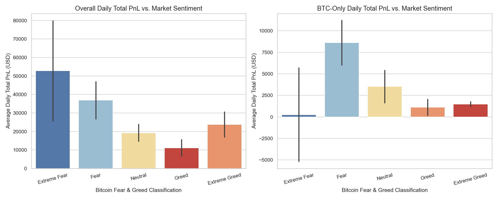
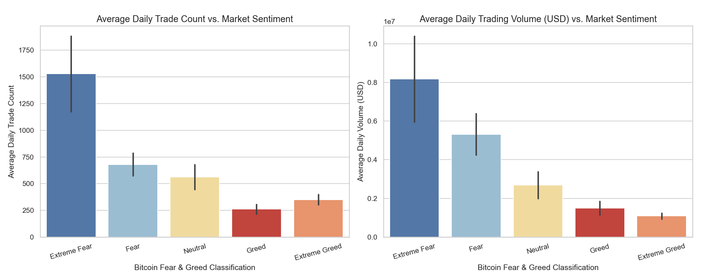
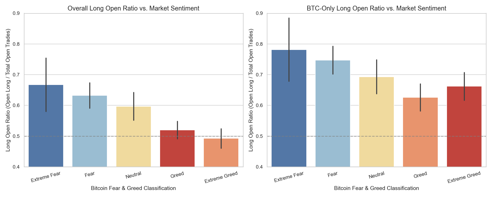
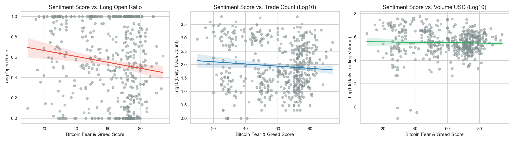

# Executive Report: Bitcoin Market Sentiment & Trader Performance Analysis
**Prepared for**: Primetrade.ai Hiring Team  
**Author**: Data Science Candidate  
**Date**: June 1, 2026  
**Analysis Period**: May 1, 2023 – May 1, 2025 (2-Year Overlapping Dataset)

---

## 1. Executive Summary

This report explores the relationship between market sentiment (Bitcoin Fear & Greed Index) and historical trader performance on the Hyperliquid perp DEX (211,224 individual execution rows across 246 coins, with a specific focus on BTC-only trading). 

Our statistical analysis revealed highly significant, counter-cyclical relationships between trader behavior and market sentiment:
1. **Profitability is Counter-Cyclical**: Total daily trader profits (Closed PnL) are **negatively correlated** with sentiment. Traders earn the most during periods of **Extreme Fear** ($52.8k/day average) and the least during **Greed** ($11.1k/day average).
2. **Volatility Spikes Trading Activity**: Daily trade count and trading volume are **strongly negatively correlated** with sentiment (Pearson $r \approx -0.26$, $p < 0.001$). Daily trade counts during Extreme Fear (1,529 trades/day) are **4.4x higher** than during Greed (260 trades/day).
3. **Traders are Contrarians**: Traders display strong dip-buying behavior. The **Long Open Ratio** (Open Longs / Total Opens) is **negatively correlated** with sentiment ($p = 0.0019$). During Extreme Fear, **66.7% of all opened positions are Longs** (surging to **78.2%** for BTC-only). During Extreme Greed, this drops to **49.2%**, showing traders actively hedge or short the tops.
4. **Win Rate vs. PnL Asymmetry**: During Extreme Fear, traders exhibit their **lowest win rate (65.4%)** but generate their **highest daily PnL ($52.8k)**. This indicates that while they suffer many small losses attempting to catch market bottoms, their successful trades yield massive, outsized profits.

---

## 2. Dataset & Methodology

### Data Sources
1. **Bitcoin Market Sentiment (Fear & Greed Index)**: Daily index scores ($0$ to $100$) and classifications (*Extreme Fear, Fear, Neutral, Greed, Extreme Greed*).
2. **Historical Trader Data (Hyperliquid)**: 211,224 execution rows including `Account`, `Coin`, `Side`, `Direction` (`Open Long`, `Close Short`, etc.), `Closed PnL`, `Size USD`, `Fee`, and `Timestamp IST`.

### Data Preprocessing & Alignment
- **Timestamp Correction**: The `Timestamp` column in the raw CSV suffered from a loss of precision due to scientific formatting (stored as `1.73E+12`). To prevent day-level alignment errors, we parsed the intact `Timestamp IST` column (`DD-MM-YYYY HH:MM`) using Python's `datetime` module.
- **Aggregation**: We aggregated individual trade executions into daily metrics:
  - **Daily Total PnL**: Sum of `Closed PnL`.
  - **Win Rate**: Positive PnL trades divided by non-zero PnL trades.
  - **Trading Volume**: Sum of `Size USD` traded.
  - **Trade Count**: Count of daily executions.
  - **Long Open Ratio**: `Open Long` executions divided by the sum of `Open Long` and `Open Short` executions.
  - **Buy Ratio**: `BUY` executions divided by total (`BUY` + `SELL`) executions.
  - **Total Fees**: Sum of execution fees.
- **Segmentation**: We analyzed both **Overall Trading** (across all 246 coins on Hyperliquid) and **BTC-Only Trading** to separate macro-sentiment effects from asset-specific trading.

---

## 3. Key Analytical Insights

### Insight 1: Profitability & Sentiment are Negatively Correlated
Traders perform significantly better when the market is in a state of fear. For BTC-only trading, the correlation between daily total PnL and the Fear & Greed score is **-0.1528 ($p = 0.0096$)**, which is statistically significant at the 1% level.

As shown below, daily total PnL follows a U-shaped distribution:
- During **Extreme Fear**, daily PnL peaks at **$52,793** overall.
- During **Greed**, it bottoms out at **$11,140** overall.
- During **Extreme Greed**, we see a slight bounce to **$23,817** (likely driven by momentum breakout traders).

---

### Insight 2: High Fear Triggers Aggressive Trading Activity
Market fear is a strong proxy for price volatility. When fear spikes, liquidations and panic-selling trigger massive trading activity.
- The Pearson correlation between the Fear & Greed score and **Trading Volume** is **-0.2644 ($p = 4.21 \times 10^{-9}$)**.
- The correlation with **Trade Count** is **-0.2452 ($p = 5.43 \times 10^{-8}$)**.

Traders execute an average of **1,529 trades/day** during Extreme Fear, compared to just **260 trades/day** during Greed. Daily volume similarly drops from **$8.18M/day** in Extreme Fear to **$1.50M/day** in Greed.

---

### Insight 3: Hyperliquid Traders are Contrarians
Rather than following the crowd, Hyperliquid traders trade against prevailing market sentiment:
- The correlation between sentiment score and the **Long Open Ratio** is **-0.1462 ($p = 0.0019$)** overall.
- In **Extreme Fear**, **66.7% of all opened positions are Longs** (surging to **78.2%** for BTC-only trades), meaning traders aggressively buy the dip.
- In **Extreme Greed**, **only 49.2% of opened positions are Longs** (meaning 50.8% are Shorts), showing that traders actively scale into short positions or hedge their portfolios as prices top out.

---

### Insight 4: The Win Rate vs. PnL Asymmetry
There is a fascinating divergence in Extreme Fear:
- **Win Rate** falls to its lowest level of **65.4%** overall (**67.7%** for BTC).
- Yet, **Total Daily PnL** peaks at **$52,793** overall.

This indicates that during market sell-offs, traders suffer frequent small losses as they attempt to catch the bottom (lower win rate). However, the few trades that successfully capture the reversal yield massive, outsized returns, easily eclipsing the small losses. In contrast, during Greed, traders enjoy a higher win rate (**81.3%** overall) but make much smaller total profits (**$11,140/day**), showing a low-volatility, low-reward grind.

---

## 4. Statistical Rigor (ANOVA and Correlation Summary)

To verify that these observed differences are not due to random noise, we conducted One-way ANOVA tests across the 5 sentiment classifications.

### Table 1: Daily Metrics by Sentiment Class (Overall)
| Sentiment Classification | Avg. Daily PnL (USD) | Avg. Win Rate (%) | Avg. Daily Volume (USD) | Avg. Daily Trade Count | Long Open Ratio |
|---|---|---|---|---|---|
| **Extreme Fear** | **$52,793.59** | 65.44% | **$8.18M** | **1,529** | **66.75%** |
| **Fear** | $36,891.82 | **88.07%** | $5.31M | 680 | 63.24% |
| **Neutral** | $19,297.32 | 79.38% | $2.69M | 562 | 59.69% |
| **Greed** | $11,140.57 | 81.30% | $1.50M | 261 | 52.00% |
| **Extreme Greed** | $23,817.29 | **88.65%** | $1.09M | 351 | 49.25% |
| **ANOVA p-value** | **0.0259** ($\star$) | **0.0016** ($\star\star$) | **1.83e-08** ($\star\star\star$) | **1.14e-09** ($\star\star\star$) | **0.0357** ($\star$) |

*(Significance levels: $\star$ $p < 0.05$, $\star\star$ $p < 0.01$, $\star\star\star$ $p < 0.001$)*

### Table 2: Daily Metrics by Sentiment Class (BTC-Only)
| Sentiment Classification | Avg. Daily PnL (USD) | Avg. Win Rate (%) | Avg. Daily Volume (USD) | Avg. Daily Trade Count | Long Open Ratio |
|---|---|---|---|---|---|
| **Extreme Fear** | $254.74 | 67.70% | $3.06M | 147 | **78.17%** |
| **Fear** | **$8,618.74** | **85.07%** | **$5.37M** | **176** | 74.74% |
| **Neutral** | $3,531.50 | 83.45% | $2.09M | 101 | 69.32% |
| **Greed** | $1,121.12 | 77.25% | $1.60M | 70 | 62.61% |
| **Extreme Greed** | $1,483.57 | 84.35% | $0.65M | 36 | 66.19% |
| **ANOVA p-value** | **0.0032** ($\star\star$) | 0.3307 | **0.0006** ($\star\star\star$) | **0.0001** ($\star\star\star$) | 0.3558 |

### Table 3: Pearson Correlation vs. Continuous Sentiment Score ($0$ - $100$)
| Daily Metric | Overall Correlation ($r$) | Overall p-value | BTC-Only Correlation ($r$) | BTC-Only p-value |
|---|---|---|---|---|
| **Total Daily PnL** | -0.0826 | 0.0708 (Significant at 10%) | **-0.1528** | **0.0096** (Significant at 1%) |
| **Trading Volume** | **-0.2644** | **4.21e-09** (Significant at 1%) | **-0.2197** | **0.0002** (Significant at 1%) |
| **Trade Count** | **-0.2452** | **5.43e-08** (Significant at 1%) | **-0.2477** | **0.0000** (Significant at 1%) |
| **Long Open Ratio** | **-0.1462** | **0.0019** (Significant at 1%) | -0.0854 | 0.1615 (Not significant) |
| **Total Fee Paid** | **-0.2609** | **6.77e-09** (Significant at 1%) | **-0.2130** | **0.0003** (Significant at 1%) |

---

## 5. Strategic Recommendations for Smarter Trading

Based on these findings, we propose three core trading strategies to drive smarter performance:

### Strategy 1: Sentiment-Based Position Sizing (Volatility Scaling)
- **Problem**: Volatility and volume are heavily concentrated in Fear periods. Greed periods are characterized by low volume and low daily PnL.
- **Solution**: Dynamically scale position sizes based on the Fear & Greed Index. Scale up trading capital/leverage exposure when the index is **below 35 (Fear)** to capture high-volatility moves. Reduce exposure and trade size when the index is **above 65 (Greed)** to avoid capital decay in low-reward, range-bound environments.

### Strategy 2: Systematized Contrarian Dip-Buying
- **Problem**: Retail sentiment is a lagging indicator; buying when sentiment is greedy and selling when it is fearful leads to underperformance.
- **Solution**: Create an automated grid or market-maker strategy that accumulates spot or opens long perpetual contracts when the Sentiment Score falls into **Extreme Fear (<20)**. Mirroring Hyperliquid's top traders, target a long open ratio of **70-80%** during panic sell-offs. Conversely, build short positions or increase hedge ratios when sentiment crosses **Greed/Extreme Greed (>75)**.

### Strategy 3: Dynamic Stop-Loss Adjustment by Sentiment
- **Problem**: During Extreme Fear, traders suffer a high frequency of stop-outs (win rate drops to 65.4%), but winning trades are highly explosive.
- **Solution**: Under Extreme Fear conditions, traders should **widen take-profit targets** to capture the massive rebound spikes, while using **tighter or trailing stop-losses** to mitigate the risk of catching a falling knife. During Greed conditions, since the win rate is high (81-88%) but average PnL is low, traders should employ **tight take-profit targets** to lock in small, steady gains before reversals occur.
